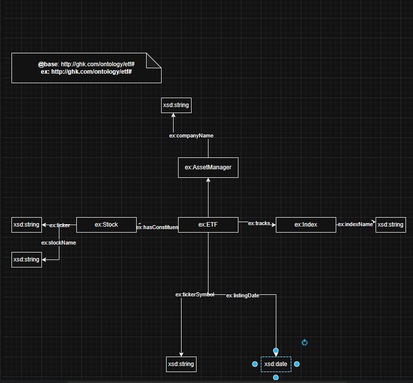

# fin-kg
Finance Products Dataset with knowledge graph

# Environments
Install dependencies using requirements.txt:
pip install -r requirements.txt

# Register a llama LLM using Modelfile
FROM ./Llama-3-8B-Instruct-v0.1.Q4_K_M.gguf
FROM ./qwen2.5-coder-1.5b-instruct-q4_k_m.gguf

# Usage
Run the backend server:
python main.py

Run the frontend server:
python -m streamlit run app.py
